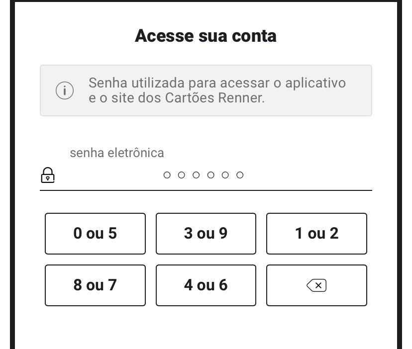

# Verificador de senha com multiplas escolhas no botão

Esse projeto foi feito afim de exemplificar a criação lógica de uma backend que verifica uma senha de acesso onde cada botão possui mais de um número possível. A partir da thread do @FelippeRegazio no twitter foi possível criar uma API que possui endpoint que soluciona esta funcionalidade.



## Instalação

O projeto foi feito em NodeJS então os passos para a instalação serão:
1. Instação de dependências: `yarn add` ou `npm install`
2. Executar em modo de desenvoolvimento: `npm run dev` ou `yarn dev`

A API possui endpoints para gerenciamento simples de usuário:

- `/users`
    - **POST**: criação de um novo usuário, onde o esquema dele será: `{login: string, password: string}`. login deverá ter **ao menos 4 caracteres** e a senha deve possuir **exatamente 6 dígitos**.
    - **GET**: retorna uma lista de todos os usuários criados
    - **DELETE**: apaga um usuário existente. É esperado o envio de um `{id: string}` contendo o identificador do usuário a ser apagado.
- `/auth`
    - **POST**: faz a verificação de autenticação da senha a partir de um array das opções de cada uma das teclas digitadas. É esperado o recebimento de um objecto da seguinte forma: `{login: string, keypads: [[int,int]] de tamanho 6}`.

## Exemplos de requisições
```json
{
	"login": "alequisk",
	"keypads": [
		[1,2],[1,2],[1,2],[1,2],[1,2],[1,2]
	]
}
```

```json
{
	"login": "alequisk",
	"password": "123456"
}
```
